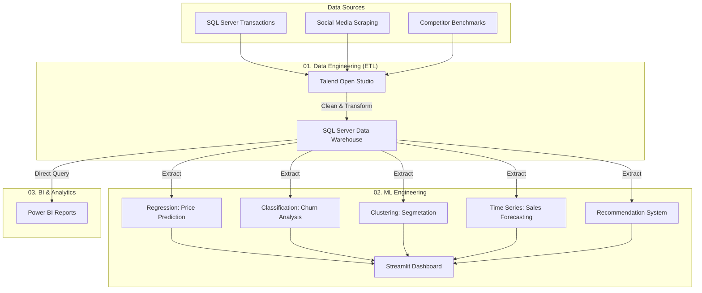

# Esprit-PI: E-Commerce Data Engineering & Advanced Analytics

[](https://www.python.org/)
[](https://www.talend.com/)
[](https://streamlit.io/)
[](https://powerbi.microsoft.com/)

## 🎯 Project Overview
This repository contains the end-to-end implementation of an **E-Commerce Data Intelligence Platform**. The goal is to transform raw transactional and social media data into actionable business insights using a robust data engineering pipeline and advanced machine learning models.

### Why this project?
In a competitive E-commerce landscape, understanding user behavior and predicting market trends is critical. This project addresses the gap between raw data collection and strategic decision-making by:
- Automating complex ETL processes from heterogeneous sources.
- Implementing predictive models for sales, churn, and recommendations.
- Visualizing KPIs for C-level executives (CEO, CMO, CFO).

---

## 🏗️ Technical Architecture



---

## 📂 Repository Structure

```text
Esprit-[PI]-[ERP/BI_6]-[2025-2026]-[E_Commerce]/
├── 01_Data_Extraction_ETL/   # Talend Jobs & SQL DDL Scripts
├── 02_ML_Engineering/        # Python Models & Streamlit Application
│   ├── models/               # Serialized Model Artifacts (.pkl)
│   ├── notebooks/            # Exploratory Data Analysis (EDA)
│   └── app.py                # Main Streamlit Application
├── 03_BI_Analytics/          # Power BI Templates & Screenshots
├── 04_Documentation/         # Project Charter, Architecture & Specifications
└── README.md                 # Strategic Overview
```

---

## 🚀 Quickstart

To get the ML Dashboard running in under 2 minutes:

### 1. Prerequisites
- Python 3.9+
- Access to the SQL Server Data Warehouse (or local CSV exports)

### 2. Installation & Run
```bash
# Clone the repository
git clone https://github.com/your-username/Esprit-PI-ERP_BI_6-2025-2026-E_Commerce.git

# Navigate to ML folder
cd 02_ML_Engineering

# Install dependencies
pip install -r requirements.txt

# Launch the dashboard
streamlit run app.py
```

---

## 💡 Key Challenges Overcome
- **Data Granularity**: Reconciling order-level vs. item-level transactions in the Data Warehouse.
- **Model Accuracy**: Tuning the XGBoost regressor to handle seasonal price fluctuations.
- **Integration**: Ensuring seamless data flow between Talend and the Streamlit UI.

---

## 👨‍💻 Author
**Student Name** - [ERP/BI 6] - Esprit 2025-2026
